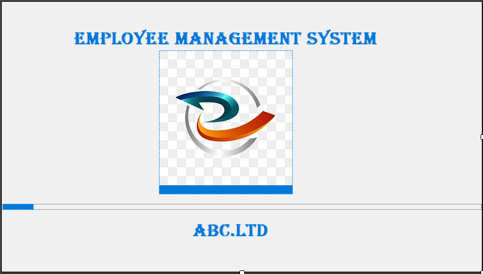

Employee Management System (VB.NET & SQL Server)

A simple Employee Management System built with VB.NET and SQL Server, allowing users to Add, Update, Delete, Search, and Print Employee Details.
📌 Features

✅ Add new employees with details (Name, Address, Position, DOB, Phone, Education, Gender)
✅ View all employees in a DataGridView
✅ Update existing employee details
✅ Delete employees from the database
✅ Search employees by ID
✅ Print employee details
✅ SQL Server database integration
🖥️ Technologies Used

    VB.NET (Windows Forms)
    SQL Server (LocalDB)
    GitHub for version control

🚀 Setup Instructions

    Clone this repository:

    git clone https://github.com/sandeepdev/EmployeeManagementSystem/tree/main

    Open the project in Visual Studio.
    Restore NuGet Packages (if needed).
    Ensure SQL Server LocalDB is installed.
    Update the connection string in sqlConnection if required.
    Run the application and start managing employees!

📄 Print Function

The application includes a Print Function, allowing users to print Employee Details directly from the application.
📷 Screenshots
SCREENSHOTS

💡 Future Improvements

🔹 Export employee data to Excel/PDF
🔹 Implement User Authentication
🔹 Improve UI design
📬 Contact

For any issues or improvements, feel free to open an issue or reach out!
